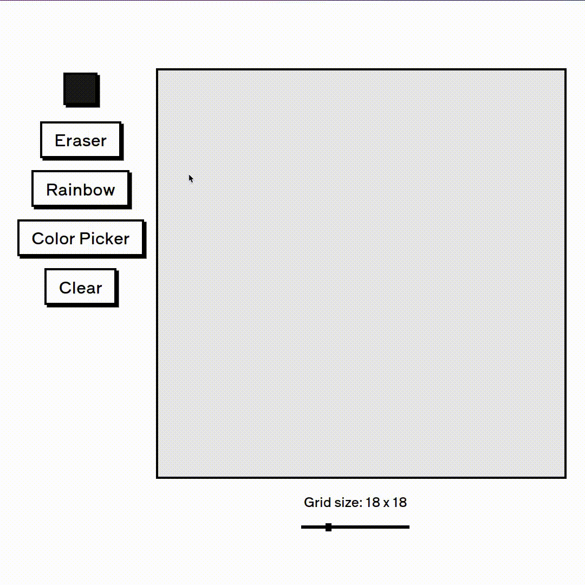

# etch-a-sketch

## About the project

### What does it do?

This web application provides a drawing environment, where the user is able to create drawings trough the use of the mouse. It also provides the capability of changing the tracing color and the grid size of the drawing area.

### Why was it made?

This project was created, above everything else, with the intent of practicing the **CSS grid layout** and mainly the **DOM manipulation** capabilities of JavaScript.

## How to use it?

Well, it's pretty simple really:
The published trough the usage of GitHub pages, so all that you need to do is click <a href="https://nicog03.github.io/etch-a-sketch/" target="_blank0">here!</a>
